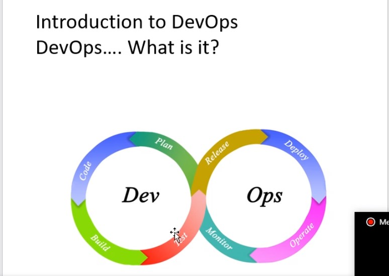
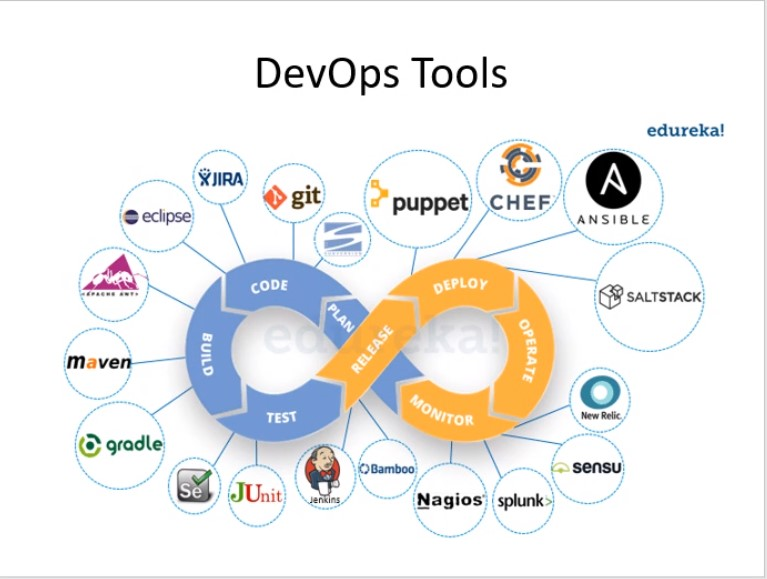
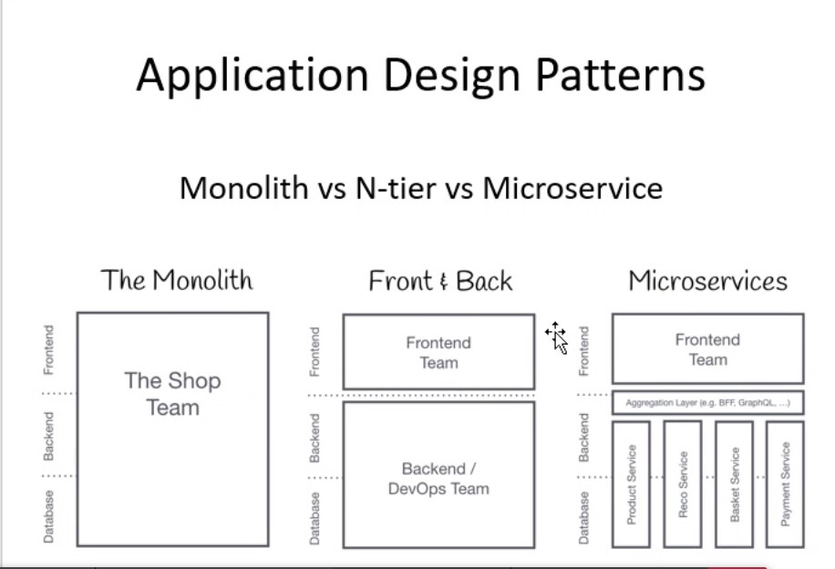

This Image Shows the DevOps life cycle

Using Agile Methodolgy and sprints to work on a project part my part and then testing,
this means when things are brought together there are problems, thus fast delivery of software

### Infrastructure Revolution

On Premise VS Cloud Computing (AWS, GitHub)

You pay for what you use with Cloud Computing, thus you can scale up or scale down depending
on the needs during that current moment.
 
On Premise services have many costs associated to them
- Maintaining Hardware, network, security, database
- Downtime
- Applying Fixes, Patches

Cloud Computing costs on the other hand
- Subscription fee
If your laptop breaks all the information is gone, however the Cloud will always have this information

### Application Design Patterns

Monolith VS N-tier VS Microservice
DevOps has microservices architecture, testing can happen within their own seperate teams. 

If a problem occurs during the monitoring stage of the cycle, the software can then
be moved straight into the planning phase of development efficiently

### Four Pillars of DevOps

- Ease of use
- Flexibility
- Robustness
- Cost Effective

## Automation
Pushing to github would trigger a build, a build would trigger a test and then a software
would run

## DevOps Principles
Customer-Centric Action
End-to-End Responsibility
Automate everything
Continuous Improvement
Work as one team
Monitor and test everything

## Stages in DevOps Lifecycle
Continuous Development
Continuous Testing
Continuous Integration
Continuous Deployment
Continuous Monitoring

## Risk Registers

- Loss of Revenue (If a customer wants to buy something and the server goes down, this is a problem)

### Infrastructure As Code 
Writing Code that will then deploy our software